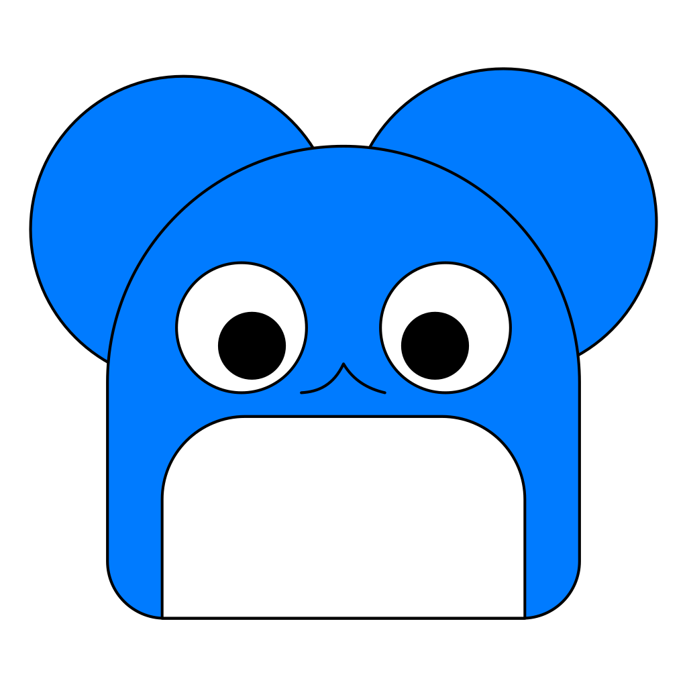

# 🌑 nepTune Engine
nepTune Engine is an experimental Go game-engine specializng in rhythm games. The name nepTune comes from the planet Neptune combined with the music term "Tune". How charming! :)

# 🌱 We are planting the seeds
nepTune is in it's very early stages of life and will likely not be ready for usage till far into the future. nepTune and it's (hopeful) tools are being created alongside a small rhythm game. As we create the latter, it allows us to add meaningful features to nepTune before publishing changes here.

It's also worth noting that nepTune is not designed to be used in serious scenarios, as we are by no means engine developers. 

### ✨ Try out nepTune with the Hello World example!
You may need to follow the setup guide first to run the example.
```
go run github.com/scruffykat/nepTuneEngine/examples/hello_world@latest
```

# 🎥 Behind The Scenes
nepTune uses SDL for most engine related content behind an abstraction designed for ease of use and quick development in rhythm games. On top of this, nepTune contains many tools built in, which can be compiled as separate developer binaries or compiled as part of your application and launched via a single function.

For example, you can bundle the scene editor in your application with the following:
```go
package main;

import "github.com/scruffykat/nepTuneEngine/tools/sceneeditor"

func main() {
    sceneeditor.Launch();
}
```

# 🧑‍💻 Setup
### Go Language
Ensure your system is setup with one of the latest versions of Go (recommended).

Guides to do so can be found on the [Go Website](https://go.dev)

### SDL + go-sdl requirements
Ensure SDL is installed. A guide for setting up SDL on your system can be found on the [go-sdl2](https://github.com/veandco/go-sdl2) repository's readme.

# 📝 nepTune Scripting (Components)
nepTune uses components to create logic in your game. For example
```go
package playercontroller

type PlayerController struct {
    speed float64
}

// Runs once when component is first used
func (pc *PlayerController) Start() {
    pc.speed = 12.0
}

// Runs every game update
func (pc *PlayerController) Update() {
    DoSomething()
}

```

```go
player.AddComponent(PlayerController{})
```

# 😗 Credits
- [go-sdl2](https://github.com/veandco/go-sdl2) - SDL for go module by [veandco](https://github.com/veandco)